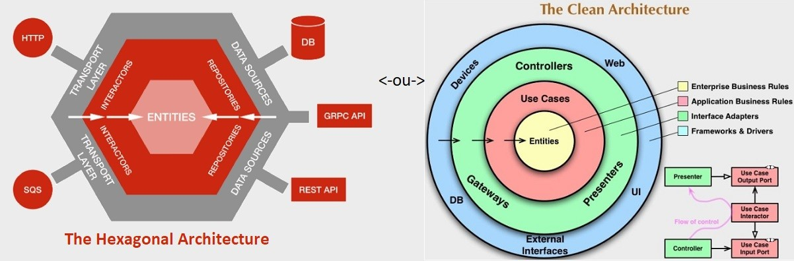

# Backend Challenge - Pokémons
>  This is a challenge by [Coodesh](https://coodesh.com/)

> Várias da implementações no projeto foram apenas para demonstrar conhecimento técnico, sem uma necessidade real de se utilizar em um projeto simples.

## Descrição projeto

Esse projeto é um teste técnico, o objetivo do projeto é o gerenciamento de pokemóns com as segeuintes funcionalidades: Busca aleatória de pokemons, busca de pokemón por id, cadastro de um mestre pokemón, cadastro de captura de pokemón e listagem de pokemóns capturados.

Os dados dos pokemós serão fornecidos pela api: [https://pokeapi.co/](https://pokeapi.co/ "https://pokeapi.co/")

## Estratégia de desenvolvimento

A cada busca na api pokeapi o resultado da busca é salvo em um cache em memória, que apoia nas futuras buscas, sempre que ocorre uma nova busca a aplicação verifica primeiro no cache e caso não existe ela busca na api e atualiza o cache.
São salvos no banco de dados SQLite apenas os dados que não são fornecidos pela api.

### Tecnologias utilizadas
 
Linguagem de programação: C#.
Framework: .Net 8.
IDE: Visual Studio.
Bibliotecas Desenvolvimento: FluentValidation, Polly, Serilog, Swashbuckle.
Bibliotecas Testes Unitários: Xunit, NSubstitute, FluentAssertions.

### Arquitetura do projeto
 
 >  Optei por modelo single project, que facilita o desenvolvimento em uma arquitetura hexagonal e evitando o modelo tradicional de camadas como Infra, Domain, Domain Core e etc. Esse modelo é muito utilizado em arquiteturas de micro serviços.

 

 ### Padrões, Designers e Modelos
 
 >  Algumas das implementações foram apenas para demonstrar conhecimento, não sendo uma necessidade do projeto. 

HealthCheck: Criei um end-point de health check que ajuda ferramentas de observabilidade a monitorar a saúde da aplicação.

Fluent Validation: São validações dos dados de entrada com uma construção fluente e em bloco, com o apoio do pacote FluentValidation.

EditorConfig: É uma configuração feito no Visual Studio que com a ajuda de um arquivo padroniza as identações, erros e warnings do projeto.

Versionamento API: É o versionamento semântico dos end-points da api, o que garante que as evoluções da api não vão quebrar versões anteriores.

Open API: Configurei o swagger no projeto que facilita a documentação da api com uma interface amigavél.

Manipulador de erros: Foi criado um middleware personalizado para lidar com os erros e exceções gerados pela aplicação, isso garante uma padronização nas mensagem e trás também segurança ao expor dados dos erros de servidor.

Http Client: Optei por criar um implementação do Http Client para um melhor controle das requisições HTTP, evitando utilizar ferramentas como Refit, Flur ou Restsharp.

Configuration Builder: Implementei o padrão de leitura de arquivos de configuração e conversão em objetos c#.

## Instruções

Ao clonar o projeto e caso tenha o Visual Studio instalado no seu computador, basta executar o arquivo .sln, a IDE vai baixar os pacotes e atualiza-los, após isso basta apertar f5 ou dar play na aplicação que será criado um servidor .net ou IIS local na sua máquina e o navegador será aberto na página do swagger configurado, se não abrir basta colar https://localhost:7107/swagger/index.html nonavegador e dar enter.

Caso não queira executar através do Visual Studio, basta seguir as instruções para executar via CLI do .net 
 [https://learn.microsoft.com/en-us/dotnet/core/tools/dotnet-run](https://learn.microsoft.com/en-us/dotnet/core/tools/dotnet-run "https://learn.microsoft.com/en-us/dotnet/core/tools/dotnet-run")

